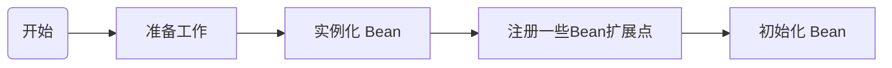

## 引言

Spring 最重要的概念是 IOC 和 AOP， 本文主要内容是通过对 Spring IOC 容器源码的重点方法粗略阅读，使读者了解 Bean 初始化的整个流程。

## 1、Spring 应用的启动

​		相信使用过 Spring Boot 进行开发的的人员，都应该对 Spring Boot 的 SpringApplication 类不陌生。该类一般在 Spring 入口类中的 main() 方法中出现，通过调用 SpringApplication  类的 run() 方法来启动。

## 2. Bean 初始化的整体流程

### 2.1 refresh() 方法分析

​	为什么要先介绍 refresh() 方法呢？

​	**因为refresh() 方法是 Spring 容器的重点，该方法涵盖了 Bean 初始化的所有流程，相当于文章的目录页。**

​	下面我将通过源码一步步展示 bean 初始化的整体流程。过程中读者一定要自己打开源码对照着看，这样才能比较清晰。

​	第一步，肯定要先从 Spring 容器的启动方法 SpringApplication.run() 方法入手。

``` java
public class SpringApplication {
    //忽略其他方法
    public ConfigurableApplicationContext run(String... args) {
        ...
        this.refreshContext(context);
        ...
    }
    //继续进入 refreshContext 方法
    private void refreshContext(ConfigurableApplicationContext context) {
        if (this.registerShutdownHook) {
            shutdownHook.registerApplicationContext(context);
        }

        this.refresh(context);
    }
    //
    protected void refresh(ConfigurableApplicationContext applicationContext) {
        applicationContext.refresh();
    }
}
```

直接进入最后一个 refresh() 接口的 AbstractApplicationContext 实现类中找到 refresh() 接口的真正实现类。

往下看，这个方法调用了许多方法，用阅读文章角度来说 refresh() 方法相当于**目录页**，包含其中的方法则是一条条目录或者标题。

我们先大致浏览该方法中的每个小方法的含义，之后再根据每个小方法进行详细解释。

``` java
//这个类中的方法就是真正的 refresh() 接口实现方法
public abstract class AbstractApplicationContext extends DefaultResourceLoader implements ConfigurableApplicationContext {
    public void refresh() throws BeansException, IllegalStateException {
        //这里使用了对象锁，保证了在调用 refresh()方法的时候无法调用 close()方法，避免了冲突
        synchronized(this.startupShutdownMonitor) {
            StartupStep contextRefresh = this.applicationStartup.start("spring.context.refresh");
            //顾名思义，该方法做的是准备工作，记录下容器启动时间，标记启动状态，处理配置文件中的占位符
            this.prepareRefresh();
            //该方法作用是：初始化 BeanFactory、加载 Bean、注册 Bean
            //该方法会将各种方式配置（注解、javaConfig、xml等方式）的 Bean 解析成一个个 BeanDefinition（该类包含了 Bean 的各种属性） 类
            //最后将 Bean 注册到 BeanFactory 中
            //注册说到底也只是一个 beanName -> BeanDefinition Map
            ConfigurableListableBeanFactory beanFactory = this.obtainFreshBeanFactory();
            //设置 BeanFactory 加载器，并手动注册几个特殊的 Bean
            this.prepareBeanFactory(beanFactory);

            try {
                // 是 BeanFactory 的扩展点，可以加入一些自定义的 BeanFactory 的后置处理器
                this.postProcessBeanFactory(beanFactory);
                StartupStep beanPostProcess = this.applicationStartup.start("spring.context.beans.post-process");
                //调用BeanFactory注册的后置处理器
                this.invokeBeanFactoryPostProcessors(beanFactory);
                //注册bean的后置处理器
                this.registerBeanPostProcessors(beanFactory);
                beanPostProcess.end();
                this.initMessageSource();
                this.initApplicationEventMulticaster();
                this.onRefresh();
                this.registerListeners();
         		// 初始化所有的 singleton beans (懒加载的除外) 画重点！！！
                this.finishBeanFactoryInitialization(beanFactory);
                this.finishRefresh();
            } catch (BeansException var10) {
                if (this.logger.isWarnEnabled()) {
                    this.logger.warn("Exception encountered during context initialization - cancelling refresh attempt: " + var10);
                }
				//如果存在异常，直接销毁已经初始化的 singleton beans
                this.destroyBeans();
                this.cancelRefresh(var10);
                throw var10;
            } finally {
                this.resetCommonCaches();
                contextRefresh.end();
            }

        }
    }
}
```


### 2.2 refresh() 方法的总结

通过对上面 refresh() 方法的走读，我们已经能够得知 Bean 的初始化重要流程：



如上图所示， Bean 初始化流程中最重要的就是 Bean 实例化以及初始化的内容，因此本文的内容也是集中于这两个过程。而其他例如初始化前后的一些操作，例如 Bean 前置或后置处理就不再赘述，或者留待后面再讲吧。

​		

## 3、 Bean 的实例化过程

### 3.1 实例化流程

从上面源码可知，obtainFreshBeanFactory() 方法承担了初始化 BeanFactory、加载 Bean、注册 Bean 等操作。那么我们就来看看源码是如何实现以上行为的。

``` java
public abstract class AbstractApplicationContext extends DefaultResourceLoader implements ConfigurableApplicationContext {
    protected ConfigurableListableBeanFactory obtainFreshBeanFactory() {
        //创建 BeanFactory、解析 Bean 配置、加载 Bean 定义、注册 Bean
        this.refreshBeanFactory();
        return this.getBeanFactory();
    }
}
```

进入 AbstractRefreshableApplicationContext.class 查看 refreshBeanFactory() 接口的实现方法

``` java
public abstract class AbstractRefreshableApplicationContext extends AbstractApplicationContext {
	protected final void refreshBeanFactory() throws BeansException {
        if (this.hasBeanFactory()) {
            this.destroyBeans();
            this.closeBeanFactory();
        }

        try {
            //初始化 BeanFactory
            DefaultListableBeanFactory beanFactory = this.createBeanFactory();
            beanFactory.setSerializationId(this.getId());
            //设置 BeanFactory 的两个配置属性：是否允许 Bean 覆盖、是否允许循环引用
            this.customizeBeanFactory(beanFactory);
            // 注册 Bean 并 Bean 到 BeanFactory 中
            this.loadBeanDefinitions(beanFactory);
            this.beanFactory = beanFactory;
        } catch (IOException var2) {
            throw new ApplicationContextException("I/O error parsing bean definition source for " + this.getDisplayName(), var2);
        }
    }
}
```

总结： 从上面代码，我们可以看到 Bean 的实例化流程中最重要的还是 Bean 的注册过程。

### 3.2 注册 Bean

由于源码注册 Bean 的过程中的细枝末节特别多，但是本文目的只是粗略阅读 Bean 初始化的全过程，因此下面我会略过许多代码，直接展示最重要的 Bean 实例化代码。

我们先从 loadBeanDefinitions() 接口入手。

如下图所示 loadBeanDefinitions() 接口有四个实现方法，

其中最重要的两个是 AbstractXmlApplicationContext.class 以及AnnotationConfigWebApplicationContext.class 类。


AbstractXmlApplicationContext 顾名思义是处理xml配置的 Bean 处理类， 而 AnnotationConfigWebApplicationContext 则是处理 注解方式配置的 Bean 处理类。而我们发现无论是哪种方式配置的 Bean ，即使其获取 Bean 信息的过程有不一样，例如 xml 配置的方式会去xml文件读取 Bean 信息，而 注解配置的方式通过注解反射的方式获取 Bean 信息，但是殊途同归，最后这两个类的实现方法都会进入到 一个  registerBeanDefinition（）方法中去。

registerBeanDefinition（）方法的作用顾名思义就是注册 Bean 定义， 该方法将 put 到一个 BeanName --> BeanDefinition 的 beanDefinitionMap 中去。

``` java
public class DefaultListableBeanFactory extends AbstractAutowireCapableBeanFactory implements ConfigurableListableBeanFactory, BeanDefinitionRegistry, Serializable {
    public void registerBeanDefinition(String beanName, BeanDefinition beanDefinition) throws BeanDefinitionStoreException {
        Assert.hasText(beanName, "Bean name must not be empty");
        Assert.notNull(beanDefinition, "BeanDefinition must not be null");
        if (beanDefinition instanceof AbstractBeanDefinition) {
            try {
                ((AbstractBeanDefinition)beanDefinition).validate();
            } catch (BeanDefinitionValidationException var8) {
                throw new BeanDefinitionStoreException(beanDefinition.getResourceDescription(), beanName, "Validation of bean definition failed", var8);
            }
        }

        BeanDefinition existingDefinition = (BeanDefinition)this.beanDefinitionMap.get(beanName);
        //判断 BeanName 是否重复
        if (existingDefinition != null) {
            if (!this.isAllowBeanDefinitionOverriding()) {
                throw new BeanDefinitionOverrideException(beanName, beanDefinition, existingDefinition);
            }

            if (existingDefinition.getRole() < beanDefinition.getRole()) {
                if (this.logger.isInfoEnabled()) {
                    this.logger.info("Overriding user-defined bean definition for bean '" + beanName + "' with a framework-generated bean definition: replacing [" + existingDefinition + "] with [" + beanDefinition + "]");
                }
            } else if (!beanDefinition.equals(existingDefinition)) {
                if (this.logger.isDebugEnabled()) {
                    this.logger.debug("Overriding bean definition for bean '" + beanName + "' with a different definition: replacing [" + existingDefinition + "] with [" + beanDefinition + "]");
                }
            } else if (this.logger.isTraceEnabled()) {
                this.logger.trace("Overriding bean definition for bean '" + beanName + "' with an equivalent definition: replacing [" + existingDefinition + "] with [" + beanDefinition + "]");
            }

            this.beanDefinitionMap.put(beanName, beanDefinition);
        } else {
            if (this.hasBeanCreationStarted()) {
                synchronized(this.beanDefinitionMap) {
                    this.beanDefinitionMap.put(beanName, beanDefinition);
                    List<String> updatedDefinitions = new ArrayList(this.beanDefinitionNames.size() + 1);
                    updatedDefinitions.addAll(this.beanDefinitionNames);
                    updatedDefinitions.add(beanName);
                    this.beanDefinitionNames = updatedDefinitions;
                    this.removeManualSingletonName(beanName);
                }
            } else {
                //正常情况会进入这个分支
                //将 BeanName 以及 BeanDefinition 存放进 beanDefinitionMap 中
                this.beanDefinitionMap.put(beanName, beanDefinition);
                //这个 list 依次存放着所有 Bean 的名称
                this.beanDefinitionNames.add(beanName);
                this.removeManualSingletonName(beanName);
            }

            this.frozenBeanDefinitionNames = null;
        }

        if (existingDefinition == null && !this.containsSingleton(beanName)) {
            if (this.isConfigurationFrozen()) {
                this.clearByTypeCache();
            }
        } else {
            this.resetBeanDefinition(beanName);
        }

    }
}
```

Bean 的实例化流程的代码真的是俄罗斯套娃，一套又一套，

但是实际上真正的实例化仅仅是将配置好的 Bean  解析并注册在一个 BeanName --> BeanDefinition 的 map 中而已

### 3.3 BeanFactory 以及 Bean 的扩展点

从最开始的 Refresh() 方法入手，obtainFreshBeanFactory() 方法注册好 Bean 之后，就会注册一些扩展点，能够在 Bean 初始化前或初始化后做一些处理。

方法的执行顺序为 postProcessBeanFactory()  --> invokeBeanFactoryPostProcessors() --> registerBeanPostProcessors()

接下来我们就看看这三种方法的含义

| 方法名                            | 作用                                                |
| --------------------------------- | :-------------------------------------------------- |
| postProcessBeanFactory()          | 注册BeanFactory后置处理器                           |
| invokeBeanFactoryPostProcessors() | 调用通过 postProcessBeanFactory()  注册的后置处理器 |
| registerBeanPostProcessors()      | 注册 Bean 的处理器                                  |


**BeanFactoryPostProcessor 和 BeanPostProcessor 的区别**

BeanFactoryPostProcessor 的作用：他会在所有bean实例化之前进行应用，主要是提供给开发者去**修改 BeanDefinition** ，以达到bean实例的生成按照自己的方式来生成。BeanDefinition 包含了 Bean 的许多属性，例如全限定类名，scope，是否懒加载，所依赖的类名等，这些都可以修改。

BeanPostProcessor 的作用：它能在 Bean 真正**初始化的前或者后对 Bean 执行一些自定义的任务**。

``` java
public interface BeanPostProcessor {
    //实例化、依赖注入完毕，在调用显示的初始化之前完成一些定制的初始化任务  
    @Nullable
    default Object postProcessBeforeInitialization(Object bean, String beanName) throws BeansException {
        return bean;
    }
	//实例化、依赖注入、初始化完毕时执行
    @Nullable
    default Object postProcessAfterInitialization(Object bean, String beanName) throws BeansException {
        return bean;
    }
}
```

所以 BeanFactoryPostProcessor 和 BeanPostProcessor 在作用上还是有本质的不同的。

## 4、 Bean 的初始化过程

上面 refresh(） 的方法说了 finishBeanFactoryInitialization() 负责 Bean 的初始化。点进去也是俄罗斯套娃一套又一套，但是我们只解说最重要的过程，那就是 Bean 是如何初始化的。

抛去俄罗斯套娃般的过程，我们最后发现无论何种方式的 Bean 初始化最后都会调用到 InstantiationStrategy 类的 `instantiate()` 方法。

**InstantiationStrategy**

InstantiationStrategy 接口定义了 Spring Bean 实例化的策略，根据创建对象情况的不同，提供了三种策略：无参构造方法、有参构造方法、工厂方法。代码如下：

``` java
public interface InstantiationStrategy {
    //默认构造方法
    Object instantiate(RootBeanDefinition var1, @Nullable String var2, BeanFactory var3) throws BeansException;

    //指定构造方法
    Object instantiate(RootBeanDefinition var1, @Nullable String var2, BeanFactory var3, Constructor<?> var4, Object... var5) throws BeansException;
	//工厂方法
    Object instantiate(RootBeanDefinition var1, @Nullable String var2, BeanFactory var3, @Nullable Object var4, Method var5, Object... var6) throws BeansException;
}
```

**SimpleInstantiationStrategy**

InstantiationStrategy 接口有两个实现类：SimpleInstantiationStrategy 和 CglibSubclassingInstantiationStrategy。SimpleInstantiationStrategy 对以上三个方法都做了简单的实现。

我们主要选择默认构造方法实现的初始化方法源码进行解析。

``` java
public class SimpleInstantiationStrategy implements InstantiationStrategy {
    public Object instantiate(RootBeanDefinition bd, @Nullable String beanName, BeanFactory owner) {
        // 如果不存在方法覆写，那就使用 java 反射进行实例化，否则使用 CGLIB
        if (!bd.hasMethodOverrides()) {
            Constructor constructorToUse;
            synchronized(bd.constructorArgumentLock) {
                constructorToUse = (Constructor)bd.resolvedConstructorOrFactoryMethod;
                if (constructorToUse == null) {
                    Class<?> clazz = bd.getBeanClass();
                    if (clazz.isInterface()) {
                        throw new BeanInstantiationException(clazz, "Specified class is an interface");
                    }

                    try {
                        if (System.getSecurityManager() != null) {
                            clazz.getClass();
                            constructorToUse = (Constructor)AccessController.doPrivileged(() -> {
                                return clazz.getDeclaredConstructor();
                            });
                        } else {
                            constructorToUse = clazz.getDeclaredConstructor();
                        }

                        bd.resolvedConstructorOrFactoryMethod = constructorToUse;
                    } catch (Throwable var9) {
                        throw new BeanInstantiationException(clazz, "No default constructor found", var9);
                    }
                }
            }
			// 利用构造函数进行实例化
            return BeanUtils.instantiateClass(constructorToUse, new Object[0]);
        } else {
            // 存在方法覆写，利用 CGLIB 来完成实例化，需要依赖于 CGLIB 生成子类，这里就不展开了
            return this.instantiateWithMethodInjection(bd, beanName, owner);
        }
    }
}
```

进入构造函数实例化方法

``` java
public abstract class BeanUtils {
    public static <T> T instantiateClass(Constructor<T> ctor, Object... args) throws BeanInstantiationException {
        Assert.notNull(ctor, "Constructor must not be null");

        try {
            ReflectionUtils.makeAccessible(ctor);
            if (KotlinDetector.isKotlinReflectPresent() && KotlinDetector.isKotlinType(ctor.getDeclaringClass())) {
                return BeanUtils.KotlinDelegate.instantiateClass(ctor, args);
            } else {
                Class<?>[] parameterTypes = ctor.getParameterTypes();
                Assert.isTrue(args.length <= parameterTypes.length, "Can't specify more arguments than constructor parameters");
                Object[] argsWithDefaultValues = new Object[args.length];

                for(int i = 0; i < args.length; ++i) {
                    if (args[i] == null) {
                        Class<?> parameterType = parameterTypes[i];
                        argsWithDefaultValues[i] = parameterType.isPrimitive() ? DEFAULT_TYPE_VALUES.get(parameterType) : null;
                    } else {
                        argsWithDefaultValues[i] = args[i];
                    }
                }
				//构造函数实现 Bean 的实例化
                return ctor.newInstance(argsWithDefaultValues);
            }
        } catch (InstantiationException var6) {
            throw new BeanInstantiationException(ctor, "Is it an abstract class?", var6);
        } catch (IllegalAccessException var7) {
            throw new BeanInstantiationException(ctor, "Is the constructor accessible?", var7);
        } catch (IllegalArgumentException var8) {
            throw new BeanInstantiationException(ctor, "Illegal arguments for constructor", var8);
        } catch (InvocationTargetException var9) {
            throw new BeanInstantiationException(ctor, "Constructor threw exception", var9.getTargetException());
        }
    }
}
```

看到这里的代码可以说是恍然大悟，原来 **Bean 的初始化使用的是反射构造函数实例化对象的方式**。

忘记构造函数初始化对象的朋友可以回忆一下：

``` java
//通过 包名+类名 获取 Bean 类型
Class cl = Class.forName("beanName");
//获得构造函数
Constructor constructor = cl.getConstructor();
//构造函数创造类实例
Object object = constructor.newInstance();
```

## 源码阅读心得

本文限于篇幅，只讲解了 Bean 初始化流程最重要的几个节点。笔者阅读源码的经验略有不足，只能尽量挑出重点讲解。

笔者作为一个经验尚浅的开发者，在阅读过程中也遇到过许多问题，例如代码量太大，无从下手等，我总结出来的经验是，就像读一本书，第一次阅读可以先走读一遍，不求甚解，先把处理流程理清楚，再针对每一个流程做深入阅读。例如本文开篇就重点讲解 refresh() 方法，通过流程图整理出初始化流程，再分点解析重点流程代码的实现。
